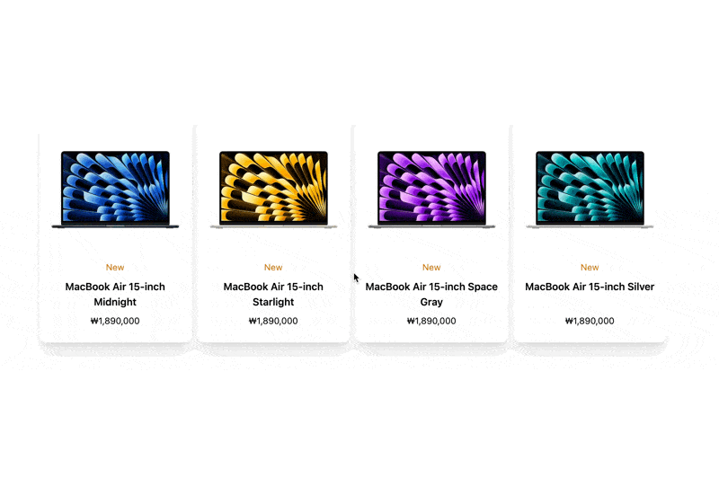

## View Transitions API 어썸 예제
[View Transitions API](https://developer.mozilla.org/en-US/docs/Web/API/View_Transitions_API)를 활용해서 제품 목록이 존재하고 제품을 클릭하면 상세 페이지로 이동하면서 이미지도 같이 이동하는 예제입니다. [photography-view-transitions-nextjs](https://github.com/domchristie/photography-view-transitions-nextjs)를 참고해서 구현하였습니다. app router 환경에서는 제대로 동작하지 않는 것 같아서 page router 환경에서 구현했습니다.

## 구현을 위한 설정
- 컴포넌트가 두번 렌더링 되지 않게 `next.config.js`의 `reactStrictMode`를 false로 설정
- 페이지 이동 시 이전 상태의 스크린샷을 찍기 위해 `ViewTransition`을 만들어서 `_app.tsx`에 감싸주어서 모든 페이지에 적용

```tsx
// ViewTransition.tsx
import { Component, StrictMode, PropsWithChildren } from 'react'

export default class ViewTransition extends Component<PropsWithChildren> {
  shouldComponentUpdate() {
    if (!document.startViewTransition) return true // skip when not supported

    document.startViewTransition(() => this.#updateDOM())
    return false // don't update the component, we'll do this manually
  }

  #updateDOM() {
    // now we know the screenshot has been taken, we can force render
    // (which skips `shouldComponentUpdate`)
    this.forceUpdate()
    // set up a promise that will resolve when the component renders
    return new Promise(resolve => { this.#rendered = resolve })
  }

  render() {
    return <StrictMode>{this.props.children}</StrictMode>
  }

  #rendered = (...args: any[]) => { }

  componentDidUpdate() {
    // resolve the `updateDOM` promise to notify the View Transition API
    // that the DOM has been updated
    this.#rendered()
  }
}
```

- 코드를 인식할 수 있게 `index.d.ts`에 `startViewTransition` 타입 정의

```ts
export { };

declare global {
  interface Document {
    startViewTransition(callback: () => void): {
      ready: Promise<void>,
      updateCallbackDone: Promise<void>,
      finished: Promise<void>
    }
  }
}

```

## 주의사항

트랜지션은 SPA 방식에서만 동작하기 때문에 Next Link 또는 React Router 를 사용해서 페이지 이동을 해야 합니다.

## 라우팅 구성

- `/list`: 상품 목록 페이지, 상품 클릭 시 상세 페이지로 이동
- `/list/[id]`: 상품 상세 페이지, 상품 이미지 클릭 시 목록으로 이동

## 구현 화면

